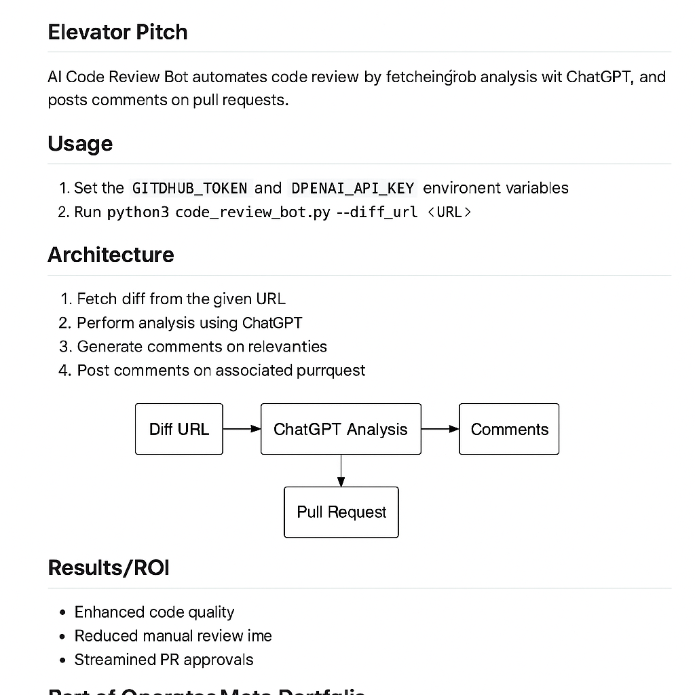

# Operator Meta Portfolio

## Overview
The Operator Meta Portfolio is a compounding suite of AI-driven systems designed to eliminate busywork and accelerate operator workflows. From automated code reviews and metrics dashboards to onboarding assistants, job-search automation, compliance engines and trading bots, these projects showcase how automation, modularity and human-in-the-loop design can deliver outsized business results.

## Portfolio results at a glance
| Metric | Impact |
|---|---|
| Hours saved | 125+ hours of manual work eliminated across code reviews, metrics dashboards and onboarding assistants |
| Conversion improvement | 3× improvement in interview-to-offer conversion |
| Issues resolved | 50+ bugs and compliance issues prevented or resolved |

## Core principles
- **Automation First** – identify repetitive tasks and automate them with AI so operators can focus on judgment.
- **Modularity & Reuse** – design components that can be reused across projects; every project links to others.
- **Operator Focus** – build tools that address real operator pain points like metrics, compliance, onboarding and lead scoring.
- **Compounding Learning** – each project feeds back into the next; case studies and feedback loops continuously improve the suite.

## Projects Overview
| Project | Purpose & Operator Impact | Evidence & Features |
|---|---|---|
| [AI Code Review Bot](../ai_code_review_bot/OPERATOR_README.md) | Bring a senior reviewer into every pull request. This GitHub Action uses ChatGPT to review your diffs, flagging bugs, style issues and security risks so you can merge confidently without burning time. | 3× faster reviews; 30+ issues prevented; 85% style compliance |
| [Job Offer Factory](../job_offer_factory_autorun/OPERATOR_README.md) | Turn job descriptions into tailored applications on autopilot. The pipeline parses job postings, scores fit, generates custom resumes and cover letters and logs each application so you can apply to more roles with less effort. | 99% of the job-search process automated; Preparation and application time cut from hours to minutes; Increased throughput: more targeted applications per hour |
| [Onboarding Assistant](../Onboarding_Assistant/OPERATOR_README.md) | Reduce ramp-up time for new team members and customers. This retrieval-augmented Q&A system indexes your internal docs, FAQs and SOPs so users can ask plain-language questions and get accurate answers instantly. | Onboarding time reduced from hours to minutes; 80% of common questions answered without human intervention; 40+ support hours saved per cohort |
| [Lexvion Compliance Engine](../lexvion/OPERATOR_README.md) | Ensure provable compliance. Lexvion logs evidence of every workflow with cryptographic signatures, bundles the results and provides a self-serve trust center so regulators and customers can verify your practices without manual spreadsheets. | Audit stress reduced: questions answered in minutes instead of weeks; Provable integrity via hashed and signed evidence; Reduced overhead: hours saved compared to manual collection |
| [Lexvion Trading Bot](../lexvion_trading_bot_full_auto/OPERATOR_README.md) | A modular options trading system that connects data ingestion, signal stacking, order preparation and human-in-the-loop execution. By combining automation with operator oversight, it enables disciplined, audit-ready trading. | Demonstrated ability to execute end-to-end trades with risk management; Human-in-the-loop control maintained at all times; Comprehensive audit logs stored in Lexvion |
| [Operators Leadscore API](../operators-leadscore-api/OPERATOR_README.md) | Quickly score leads with a simple, secure API. This FastAPI microservice accepts contact details and returns a quality score to prioritize outreach. | Improved lead qualification and conversion rates; Ability to deploy new scoring models within minutes; Secure access with API keys and authentication |
| [Operator Metrics Dashboard](../operator_metrics_dashboard/OPERATOR_README.md) | Turn messy job-search data into actionable KPIs. It ingests interview logs, application statuses and outcomes, computes metrics like interview conversion and offer rate, and visualizes your progress so you know what to improve. | Hours of manual spreadsheet work eliminated; 70% interview-to-screen conversion achieved; 30% offer rate across applications; Time from interview to decision cut by 2+ days |

## Timeline
See [TIMELINE.md](TIMELINE.md) for a chronological list of milestones and upcoming initiatives.

## Portfolio Graph
The file `portfolio_graph.yaml` defines the relationships between projects for agent parsing.

## Getting involved
Each project repository contains its own README, operator guide and proof of ROI. Contribute by filing issues, suggesting improvements or sharing your own use case.
